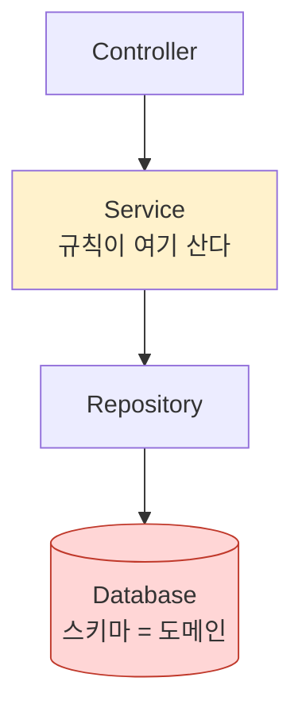
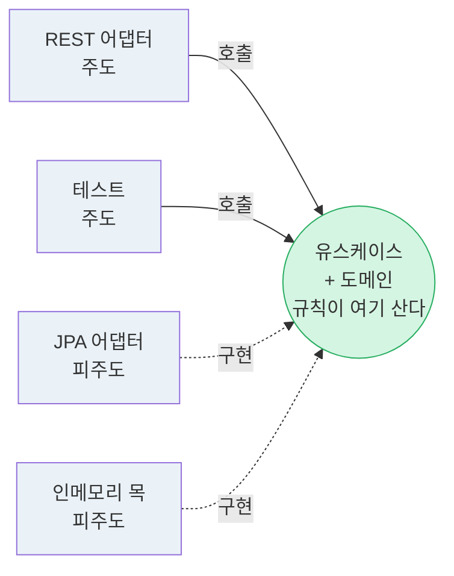
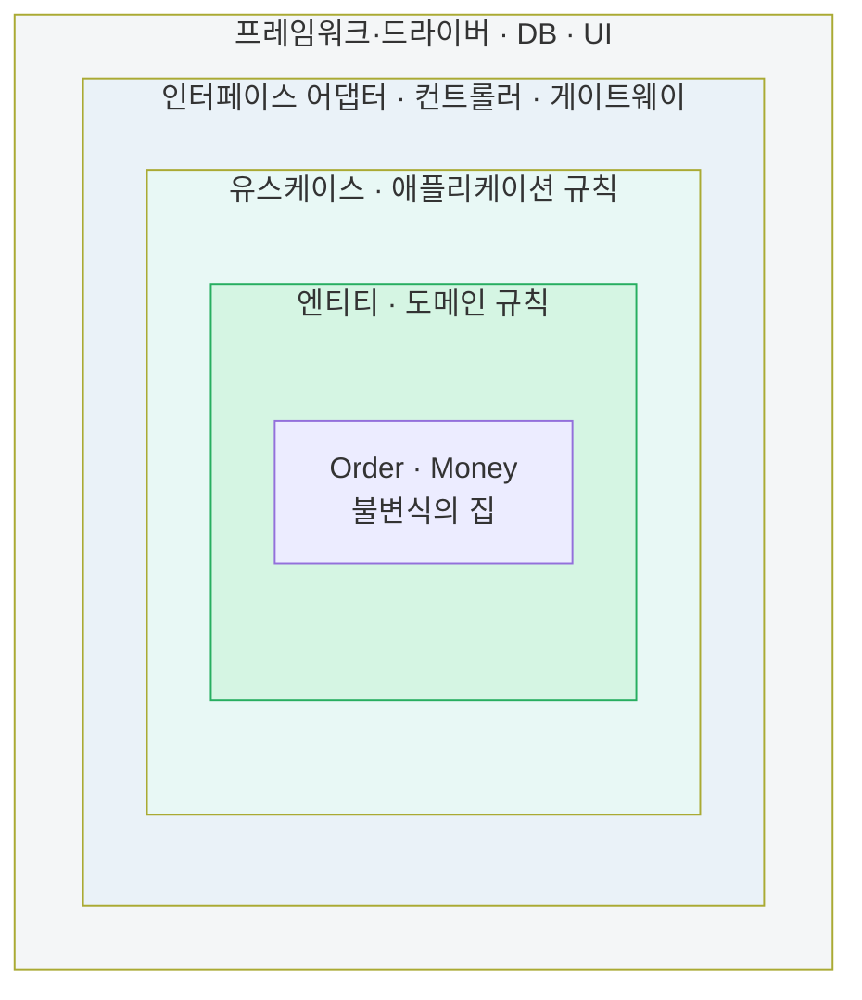
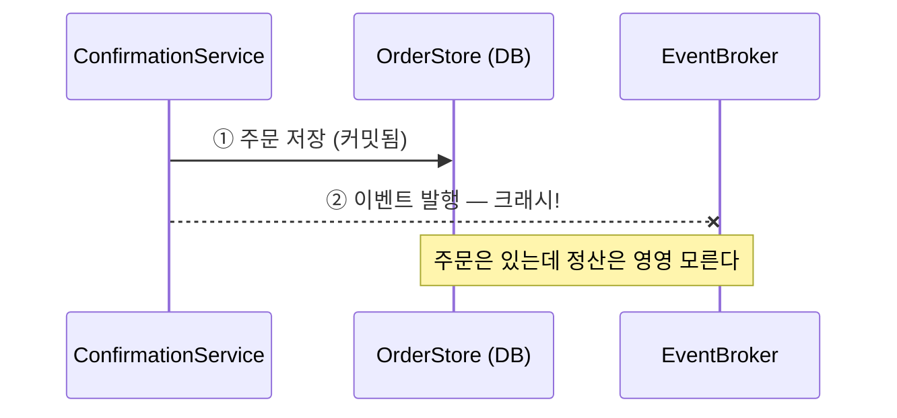
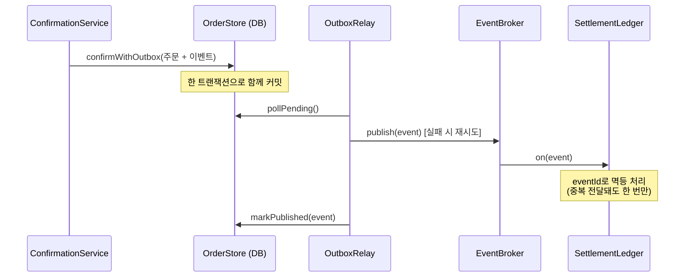
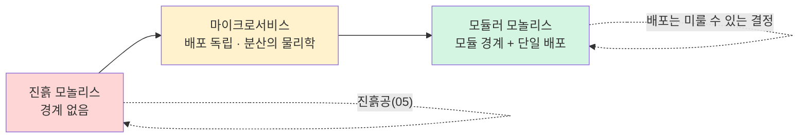
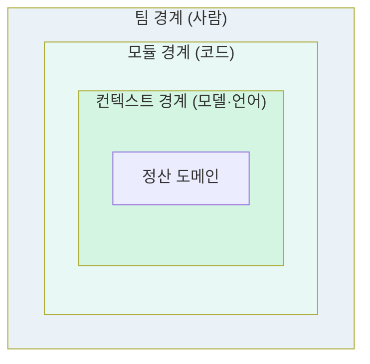

# 부록 E. 시각 자료 — 화살표를 눈으로

이 책의 주제는 "화살표의 방향"이었다. 그렇다면 화살표를 그려서 보여주는 것이 마땅하다. 아래 다이어그램은 본문의 핵심 그림들을 한자리에 모은 것이다(GitHub에서 렌더링된다). 각 그림 아래에 해당 장을 표기했다.

---

## E.1 같은 박스, 다른 화살표 — 레이어드 vs 헥사고날 (Step 03, 06, 08)

이 책 전체를 관통하는 대비다. 박스의 목록은 같지만 화살표의 종착지가 다르다.

**레이어드 — 모든 화살표가 아래, 결국 DB로.** 가장 구체적인 것(스키마)이 가장 안정된 자리(모두가 의존)에 앉는다. 안정 추상 원칙(SAP) 위반이 곧 이 그림이다.

**헥사고날 — 바깥의 양쪽이 모두 안(도메인)을 향한다.** UI도 DB도 똑같은 "바깥"이고, 도메인이 가장 안정된 자리에 앉는다. 주도 어댑터는 호출로, 피주도 어댑터는 구현으로 — 방향은 둘 다 안쪽이다.

핵심은 화살표의 개수가 아니라 **종착지**다. 왼쪽에서는 화살표가 DB(빨강, 가장 구체적)로 모이고, 오른쪽에서는 도메인(초록, 가장 추상적)으로 모인다. Step 03의 안정 추상 원칙이 요구한 배치는 오른쪽이다.

---

## E.2 세 형제는 같은 원리다 — 동심원 (Step 08)

어니언과 클린은 헥사고날이 비워둔 "내부"를 동심원으로 채운 상세도다. 규칙은 하나 — **의존성은 오직 안쪽을 향한다.**

바깥 링일수록 자주 바뀌는 것(기술), 안쪽 링일수록 덜 바뀌는 것(도메인). 전단층(Step 05)이 변경 속도 순으로 배치된 것 — Brand의 건물 층이 정확히 이 순서였다. 헥사고날의 포트/어댑터 어휘로 옮기면: 가장 바깥 링이 어댑터, 안쪽 두 링이 육각형의 내부다.

---

## E.3 이중 쓰기 문제와 아웃박스 (Step 11)

**문제 — 두 시스템에 두 번 쓰기.** 두 쓰기가 하나의 트랜잭션이 아니라, 사이에서 죽으면 불일치가 영구화된다.

**처방 — 트랜잭셔널 아웃박스.** 이벤트를 브로커가 아니라 같은 DB에, 업무 데이터와 한 트랜잭션으로 커밋한다. 별도 릴레이가 나중에 옮긴다. 원자성을 "성립하는 곳"으로 옮긴 것.

이 시퀀스가 `architecture/src/main/java/org/hyeonqz/architecture/data/`의 코드와 `DualWriteTest`·`IdempotencyTest`로 그대로 실행된다.

---

## E.4 진자, 그러나 나선 — 배포 토폴로지의 역사 (Step 10)

논리적 결합은 단조적으로 끊겨 왔지만, 물리적 배포 결합은 진동했다. 돌아온 자리는 출발점이 아니라 나선의 한 칸 위다.

A에서 C로의 화살표가 "제자리로 돌아옴"처럼 보이지만, A의 모놀리스는 진흙공이었고 C의 모놀리스는 컨텍스트 경계·데이터 소유권·모듈 규율을 갖췄다. 같은 "모놀리스"라는 단어가 가리키는 것이 다르다 — 그것이 나선이다.

---

## E.5 경계의 삼중 정렬 (Step 09)

건강한 상태는 세 경계가 겹치는 것이다. 어긋나면 그 비용이 "조율"이라는 화폐로 청구된다.

한 팀이 한 컨텍스트를 한 모듈로 소유할 때, "부분 취소 추가" 같은 변경이 그 팀 안에 갇힌다. 이 정렬을 조직 쪽에서 만들어내는 것이 역 Conway 전략이다.
