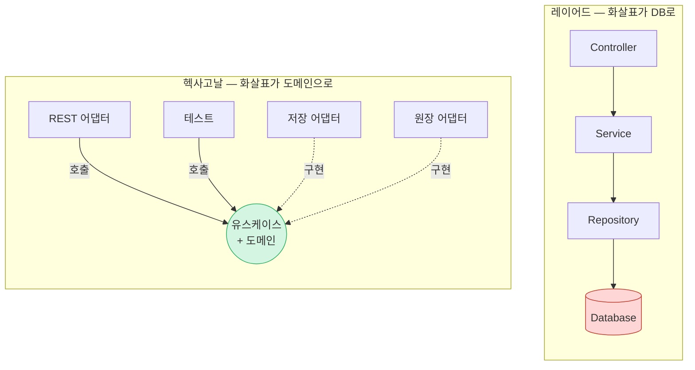

# Step 13. 같은 요구사항, 세 가지 아키텍처


*만화로 보는 요약 — 먼저 읽어보세요*

**작은 요구에는 레이어드가 가장 단순하지만, 규칙과 변경이 쌓이면 헥사고날의 의존성 방향과 테스트 가능성이 변경의 파급을 가둔다.**

> 면접 실전 질문: ① 작은 시스템에서 레이어드가 유리한 이유는? ② 헥사고날은 테스트를 어떻게 바꾸는가? ③ 변경 시 diff는 어디서 폭발하는가?

---

> **이 장의 질문**: 같은 규칙, 같은 기능을 레이어드와 헥사고날로 각각 구현하면 — 정확히 어디가, 언제, 왜 달라지는가?
> 이 장부터는 말이 아니라 코드다. 모든 코드는 `architecture` 모듈에 있고, 전부 컴파일되고 테스트가 돈다.

---

## 1. 실험 설계

**도메인**: 주문/정산. 규칙은 딱 둘 — 이 책의 최소 단위다.

- R1. 정산 완료된 주문은 취소할 수 없다.
- R2. 정산 수수료는 금액의 3%다.

**기능**: 주문 등록, 취소, 정산(수수료 계산 + 원장 기록).

**구현 둘, 어휘 셋**: 같은 요구사항을 `layered`와 `hexagonal` 패키지에 각각 구현했다. "클린은 어디 있나?"라는 질문에는 Step 08이 이미 답했다 — 셋은 어휘가 다른 한 원리다. 6절에서 보겠지만, 우리의 헥사고날 구현은 패키지 이름만 바꾸면 그대로 교과서적 클린 아키텍처다. 세 번째 구현을 만드는 것은 같은 코드를 두 번 커밋하는 일이라, 하지 않는 것이 정직하다.

**정직한 단순화 하나**: 저장소는 실제 MySQL 대신 맵으로 흉내냈다. 요점은 저장 기술이 아니라 **화살표** — 소스 코드가 누구의 이름을 아는가 — 이고, 그것은 맵으로도 완벽히 재현된다. "실제라면 이 자리에 MySQL 컨테이너가 있다"는 각주가 붙는 곳을 눈여겨보라.

```
architecture/src/main/java/org/hyeonqz/architecture/
├── layered/
│   ├── controller/OrderController.java
│   ├── service/OrderService.java          ← 규칙 R1, R2가 여기 산다
│   ├── repository/MySqlOrderRepository.java
│   └── entity/Order.java                  ← 빈혈: getter/setter뿐
└── hexagonal/
    ├── domain/Order.java                  ← 규칙 R1, R2가 여기 산다 (리치)
    ├── domain/Settlement.java             ← 값 객체
    ├── domain/OrderRepository.java        ← 피주도 포트 (도메인 소유)
    ├── domain/SettlementLedger.java       ← 피주도 포트
    ├── application/OrderCommandService.java  ← 유스케이스 (조율만)
    └── adapter/InMemoryOrderRepository.java, ConsoleLedger.java
```

두 구현의 화살표를 그림으로 먼저 보자. 박스의 목록은 사실상 같은데 종착지가 다르다 — 왼쪽은 DB로, 오른쪽은 도메인으로.



(더 많은 그림 — 어니언/클린 동심원, 아웃박스 시퀀스, 진자→나선 — 은 부록 E에 모아뒀다.)

## 2. 레이어드 구현 — 익숙한 그 모습

`layered`의 화살표: `controller → service → repository → entity`. 전부 아래로, Step 06의 그림 그대로다. 규칙은 어디 사는가:

```java
// layered/service/OrderService.java — 트랜잭션 스크립트
private final MySqlOrderRepository orderRepository = new MySqlOrderRepository();

public void cancel(String orderId) {
    Order order = orderRepository.findById(orderId);
    if ("SETTLED".equals(order.getStatus()))          // R1이 서비스에 산다
        throw new IllegalStateException(...);
    order.setStatus("CANCELLED");                     // 객체는 시키는 대로 할 뿐
    orderRepository.save(order);
}
```

먼저 인정하자 — **이 코드는 나쁘지 않다.** 짧고, 읽히고, 아무 설명 없이 신입이 고칠 수 있다. 4개 파일 133줄로 요구사항 전부를 만족한다. 규칙이 두 개뿐인 지금, 이것은 Step 06의 변호 그대로 최적해다.

다만 화살표 하나를 기록해두자: `OrderService`는 `MySqlOrderRepository`라는 **구체 클래스의 이름**을 알고, 심지어 직접 `new`한다. 정책이 세부사항에 소스 수준으로 묶여 있다 — 지금은 안 아프다. 언제 아픈지는 4~5절에서.

공정성을 위한 각주 하나. 관용적인 스프링 레이어드는 이렇게 `new`하지 않는다 — Spring Data 리포지토리 *인터페이스*를 주입받는다(여기의 `new`는 DI를 걷어낸 압축이다). 그러나 인터페이스가 있어도 병의 본체는 남는다: 그 인터페이스는 도메인이 아니라 **영속 계층이 소유**하고(`JpaRepository`를 상속한다는 사실 자체가 증거다), 엔티티는 여전히 테이블의 거울상이며, 규칙은 여전히 서비스에 산다. 화살표의 종착지가 구체 클래스에서 영속 소유의 인터페이스로 바뀔 뿐, **방향은 같다** — Step 03의 오해 2(형식적 인터페이스는 아무것도 뒤집지 않는다) 그대로다.

## 3. 헥사고날 구현 — 화살표를 뒤집은 모습

`hexagonal`의 화살표: `adapter → domain ← application`. 규칙은 개념과 동거한다:

```java
// hexagonal/domain/Order.java — 리치 도메인 모델
public void cancel() {
    if (status == Status.SETTLED)                     // R1이 개념과 동거한다
        throw new IllegalStateException(...);
    status = Status.CANCELLED;
}

public Settlement settle() {                          // R2도 — 수수료는 주문이 계산한다
    ...
    return new Settlement(id, amount, amount.multiply(FEE_RATE));
}
```

```java
// hexagonal/domain/OrderRepository.java — 피주도 포트, "도메인 패키지에" 산다
public interface OrderRepository {
    Order byId(String orderId);   // 메서드가 SQL이 아니라 정책의 언어를 닮는다
    void save(Order order);
}
```

유스케이스(`OrderCommandService`)는 포트들 사이의 조율만 한다 — 구체 기술의 이름이 **한 줄도 없다.** 어댑터(`InMemoryOrderRepository`, `ConsoleLedger`)가 바깥에서 포트를 구현한다. Step 03의 소유권 역전, Step 08의 포트/어댑터가 코드 열 줄로 육화된 것이다.

비용도 즉시 보인다: 7개 파일 161줄. 같은 기능인데 **파일 3개, 줄 수 21%의 할증**이다. 인터페이스 2개와 생성자 주입이 그 청구서다. 규칙 두 개짜리 도메인에서 이 할증이 정당한가? — 아직은 아니다. 계속 가자.

## 4. 증거 1 — 테스트가 말하는 것

두 구현의 같은 규칙(R1) 테스트를 나란히 놓는다. 이 대비가 이 장의 첫 번째 페이오프다.

```java
// layered: 규칙 하나를 검증하는데 저장소가 통째로 함께 뜬다
@Test
void 정산_완료된_주문은_취소할_수_없다() {
    OrderService service = new OrderService();        // 안에서 저장소가 new된다
    service.register("A-1", new BigDecimal("10000")); // 저장소에 넣고
    service.settle("A-1");                            // 저장소에서 읽고 쓰고
    assertThrows(IllegalStateException.class, () -> service.cancel("A-1"));
}
```

```java
// hexagonal: 규칙 검증에는 도메인 객체 하나면 된다
@Test
void 정산_완료된_주문은_취소할_수_없다() {
    Order order = new Order("A-1", new BigDecimal("10000"));
    order.settle();
    assertThrows(IllegalStateException.class, order::cancel);
}
```

지금은 둘 다 빠르다 — 저장소가 맵이니까. 그러나 화살표를 보라. 레이어드 테스트는 **저장소를 경유하지 않고는 규칙에 도달할 수 없다.** 저장소가 실제 MySQL이 되는 순간, 왼쪽 테스트는 컨테이너를 띄우고 스키마를 마이그레이션하고 수백 밀리초를 기다린다. 오른쪽은 영원히 그대로다 — 규칙이 저장과 소스 수준에서 무관하기 때문이다.

유스케이스 테스트에서는 Step 08의 문장이 문자 그대로 실행된다. 테스트가 곧 **주도 어댑터**이고(REST 컨트롤러와 동등한 자격으로 유스케이스를 호출), 피주도 포트에는 목을 꽂는다 — 원장 포트의 목은 `recorded::add`, 메서드 참조 한 줄이다.

## 5. 증거 2 — 변경 시나리오: diff는 어디서 폭발하는가

정적 스냅샷으로는 아키텍처의 가치가 안 보인다(Step 04 — 아키텍처의 목적은 변경 비용). 세 가지 변경을 때려보자.

**시나리오 A: "정산 결과를 콘솔 대신 카프카로 발행해주세요."**
- 헥사고날: `adapter/KafkaLedger.java` **파일 하나 추가**, 조립 지점에서 갈아끼움. `domain`, `application`의 diff는 **0줄**. `ConsoleLedger` 옆에 나란히 두고 둘 다 쓸 수도 있다.
- 레이어드: `OrderService.settle()` **수정**. 원장 기록이 서비스 본문에 박혀 있으므로(`System.out.println` 자리), 정책 코드에 카프카 클라이언트가 들어온다. 이제 서비스 테스트는 카프카 목이 필요하다.
- 판정: 헥사고날 압승. 이것이 포트를 뚫어둔 이유다.

**시나리오 B: "저장소를 MySQL에서 다른 DB로 바꿔주세요."**
- 헥사고날: 어댑터 교체. 도메인·유스케이스 diff 0줄.
- 레이어드: 정직하게 적자 — **이 장난감 코드에서는 레이어드도 교체가 국소화된다**(엔티티가 애노테이션 없는 POJO라서). B의 고통이 나타나는 것은 현실의 레이어드에서다: 엔티티가 JPA 테이블 거울상이 되고, 서비스가 벤더 특화 쿼리와 트랜잭션 세부에 젖을 때(Step 06의 "스키마가 도메인을 정의한다") — 그때 diff가 서비스와 엔티티로 번진다.
- 판정: 헥사고날 승. 단, 정직하게 — **DB 교체는 드문 사건이다.** 이 시나리오만으로 할증을 정당화하려 하면 과잉 설계의 알리바이가 된다. 진짜 가치는 A(흔한 사건)와 다음의 C에서 나온다.

**시나리오 C: "수수료율이 채널별로 달라집니다. 그리고 5만 원 초과 주문은 취소 시 승인이 필요합니다."** — 규칙이 *늘어나는* 시나리오.
- 레이어드: 모든 규칙이 `OrderService`에 쌓인다. 메서드가 자라고, 조건이 중첩되고, 어느 날 `OrderBatchService`가 같은 취소 검증을 복사해 간다 — 불변식을 지킬 단일 장소가 없으므로(Step 06) 복제가 구조적으로 유인된다.
- 헥사고날: 규칙은 `Order`(와 새 값 객체들)에 쌓인다. 단일 장소가 있으므로 복제 유인이 구조적으로 낮고, 각 규칙은 4절의 밀리초 테스트로 즉시 검증된다.
- 판정: **이것이 갈림길의 실체다.** Fowler의 복잡도 곡선(Step 07)의 교차점은 DB 교체 같은 극적 사건이 아니라, 규칙이 하나씩 늘어나는 이 지루한 축적에서 온다.

이 판정은 이 책의 중심 주장이므로, 산문으로 끝내지 않고 코드로 증명한다. `growth` 패키지에 시나리오 C를 그대로 구현했다 — 규칙 2("5만 원 초과 취소는 승인 필요")를 나중에 추가하고, 두 진입점(대화형 취소 + 배치 취소)이 그 규칙을 어떻게 다르게 겪는지를 테스트로 박제했다.

**레이어드 — 규칙이 서비스에 살아 드리프트한다.** 배치 서비스는 나중에, 다른 스프린트에 추가되며 취소 검증을 `OrderService`에서 복사해 갔다. 복사한 시점에는 규칙 1("정산 완료 취소 금지")만 있었고, 이후 추가된 규칙 2는 이 경로에 반영되지 않았다.

```java
// growth/layered/OrderBatchService.java — 복사된 검증이 드리프트한다
public void cancelStale(List<String> orderIds) {
    for (String orderId : orderIds) {
        Order order = store.get(orderId);
        if ("SETTLED".equals(order.getStatus())) continue; // 복사해온 규칙 1
        // 규칙 2(고액 승인)가 여기 없다 — 복제가 드리프트했다
        order.setStatus("CANCELLED");
    }
}
```

`LayeredDriftTest`가 그 결과를 잡는다: 대화형 경로는 6만 원 주문의 무승인 취소를 `ApprovalRequiredException`으로 막는데, **배치 경로는 같은 주문을 승인 없이 취소한다.** 같은 고액 주문이 진입점에 따라 다르게 처리되는 것 — 이것이 "diff가 폭발하는" 장면이다.

**헥사고날 — 규칙이 도메인에 살아 드리프트할 수 없다.** 취소하려면 반드시 `Order.cancel()`을 거쳐야 하므로, 배치를 짠 사람은 복사할 것이 없다(규칙이 도메인에 있다). 규칙 2가 `Order.cancel()`에 더해지면 두 경로가 자동으로 그것을 강제받는다.

```java
// growth/hexagonal/BatchCancelUseCase.java — 배치도 결국 order.cancel()을 부른다
Order order = repository.byId(orderId);
try {
    order.cancel(false);              // 규칙은 도메인이 지킨다 — 우회 불가
    repository.save(order);
} catch (ApprovalRequiredException | IllegalStateException e) {
    needsReview.add(orderId);          // 막힌 주문은 검토 목록으로
}
```

`HexagonalSinglePlaceTest`는 배치 경로도 6만 원 주문에 막혀 취소하지 못하고 검토 목록으로 떨어뜨림을 확인한다. 레이어드에서 드리프트했던 바로 그 버그가 **구조적으로 발생 불가능**하다.

기제를 한 줄로 못박자. **레이어드에서 규칙 하나를 추가하는 비용은 진입점 수에 비례한다** — 모든 진입점을 찾아 고쳐야 하고, 하나라도 놓치면 위의 버그다. 헥사고날은 진입점이 몇 개든 도메인 한 곳이다. 이 **상수 대 선형**의 차이가 Fowler의 복잡도 곡선이 교차하는 지점의 정체다. 규칙이 둘일 땐 선형이 상수보다 싸지만(그래서 레이어드가 이긴다), 규칙과 진입점이 쌓일수록 선형이 먼저 폭발한다.

정직한 각주: 규율 있는 레이어드 팀이라면 배치를 `OrderService.cancel()`로 라우팅하거나 공용 검증기를 추출해 이 드리프트를 피할 수 있다. 단, 그 우회로들도 `setStatus`가 열려 있는 한 임시방편이다 — 다섯 번째 진입점이 검증기를 부르지 않고 `setStatus("CANCELLED")`를 직접 호출하면 규칙은 다시 뚫린다. 규율 없이 보장되는 유일한 구조적 수리는 setter를 없애는 것, 곧 도메인 캡슐화(헥사고날의 바로 그 이동)뿐이다(Step 06의 "setter가 열려 있으면 어떤 규칙도 강제할 수 없다"). 요점은 "레이어드는 반드시 드리프트한다"가 아니라, **헥사고날에서는 단일 장소(도메인 객체)가 이미 가장 저항 적은 경로여서 규율이 필요 없다**는 것이다 — Step 06에서 "복제는 필연"이 아니라 "구조적으로 유인된다"로 적은 이유가 이것이다.

```
architecture/src/main/java/org/hyeonqz/architecture/growth/
├── layered/     OrderService(규칙 2개) + OrderBatchService(복사·드리프트)
└── hexagonal/   Order.cancel(규칙 2개) + CancelOrderUseCase + BatchCancelUseCase(공유)
architecture/src/test/java/org/hyeonqz/architecture/growth/
├── LayeredDriftTest       — 두 경로가 드리프트해 고액 주문이 무승인 취소됨(버그 시연)
└── HexagonalSinglePlaceTest — 두 경로가 같은 규칙에 막힘(버그 불가능)
```

## 6. 클린은 어디 있는가 — 어휘 매핑

우리의 헥사고날 구현에 클린 아키텍처의 어휘를 겹쳐보면:

| 이 코드의 패키지 | 헥사고날 어휘 | 클린 어휘 |
|---|---|---|
| `hexagonal/domain` | 육각형의 중심 | 엔티티 (+ 도메인 소유 포트) |
| `hexagonal/application` | 육각형의 안쪽 | 유스케이스 |
| `hexagonal/adapter` | 어댑터 | 인터페이스 어댑터 |
| (없음 — 테스트가 대신) | 주도 어댑터 | 프레임워크와 드라이버 |

같은 코드다. 의존성 규칙(모든 소스 의존성은 안으로)도 이미 지켜지고 있다. Step 08의 결론 — "셋 중 무엇을 고를까는 잘못된 질문" — 이 코드 수준에서 확인된 셈이다. 굳이 차이를 만들자면 클린은 `domain`을 엔티티/유스케이스 두 겹으로 더 엄격히 나누라고 권하는 정도인데, 이 규모에서 그 분리는 이미 되어 있다(`Order` vs `OrderCommandService`).

## 7. 방어선 — 이 구조는 스스로를 지키는가

Step 12의 적합도 함수가 이 모듈에 실제로 걸려 있다 — `ArchitectureRulesTest`. 도메인은 바깥(application, adapter)을 모르고, 유스케이스는 어댑터를 모르고, 패키지 간 순환은 금지된다. 이 규칙을 위반하는 커밋은 `./gradlew test`에서 빨간불이 된다.

여담 하나가 교훈이 됐다. 이 테스트를 처음 돌렸을 때 "유스케이스는 어댑터를 모른다" 규칙이 **깨졌다.** 범인은 프로덕션 코드가 아니라 **테스트 코드** — application 패키지에 사는 유스케이스 테스트가 인메모리 어댑터를 import하고 있었다. 그런데 이것은 위반이 아니다: 테스트는 주도 어댑터라서, 어댑터를 조립하는 것이 그의 일이다. 그래서 검사 대상을 프로덕션 코드로 한정했다(`DoNotIncludeTests`). 적합도 함수도 처음부터 옳게 벼려지지 않는다 — 규칙 자체가 한 번의 논쟁과 정련을 거친다는 것(Step 12의 "함수도 진화한다")을, 첫 실행이 곧바로 시연해준 셈이다.

## 8. 비용 대차대조표 — 실측

| | 레이어드 | 헥사고날 |
|---|---|---|
| 파일 수 | 4 | 7 (+어댑터 추가 시 +1씩) |
| 줄 수 (실측) | 133 | 161 (+21%) |
| 인터페이스 | 0 | 2 |
| 규칙(R1) 테스트의 전제 | 서비스 + 저장소 기동 | 도메인 객체 생성 |
| 시나리오 A(채널 추가) diff | 서비스 수정 | 어댑터 1개 추가 |
| 시나리오 C(규칙 축적) | 서비스 비대화 + 복제 위험 | 도메인에 단일 축적 |
| 신입의 첫 이해 | 즉시 (요청을 따라가면 됨) | 포트/조립 개념 선행 필요 |

결론은 Step 04의 언어로: 헥사고날은 **변경용이성(도메인 축)과 테스트가능성을 사고, 단순성과 초기 속도(파일 3개, 21%, 개념 학습)를 지불**한다. 규칙 2개인 오늘은 레이어드가 이긴다 — 인정한다. 규칙이 10개, 채널이 3개, 팀이 2개가 되는 날 환율이 역전된다. 그리고 Step 07이 경고했듯, **역전 시점은 지나고 나서야 보인다** — 그것이 이 할증을 보험이라 부르는 이유다.

---

## 9. 요약, 그리고 다음 장으로

- 같은 요구사항, 두 구현(어휘는 셋): 레이어드 4파일 133줄, 헥사고날 7파일 161줄 — **작을 땐 레이어드가 이긴다.** 실측으로 인정.
- 차이의 실체는 화살표: 레이어드의 규칙은 저장소를 경유해야 닿고, 헥사고날의 규칙은 도메인 객체 하나로 닿는다. **테스트가 그 화살표의 리트머스지다.**
- diff의 폭발 지점: 흔한 변경(채널 추가, 규칙 축적)에서 헥사고날은 diff를 어댑터/도메인 한 곳에 가둔다. 드문 변경(DB 교체)을 알리바이로 쓰지 말 것.
- 클린은 별도 구현이 아니라 같은 코드의 다른 어휘다 — 표 하나로 매핑 완료.
- 적합도 함수가 구조를 지키고, 그 규칙 자체도 첫 실행에서 한 번 정련됐다(테스트는 주도 어댑터).

**다음 장 예고**: 여기까지는 그린필드 — 빈 종이에 그리는 사치였다. 현실의 95%는 이미 굴러가는 진흙 위에서 시작한다. 멈출 수 없는 시스템을 어떻게 고쳐 긋는가 — 스트랭글러 무화과 패턴, 브라운필드 이행.

---

## 코드

| 경로 | 내용 |
|---|---|
| `architecture/src/main/java/org/hyeonqz/architecture/layered/` | 레이어드 구현 (controller/service/repository/entity) |
| `architecture/src/main/java/org/hyeonqz/architecture/hexagonal/` | 헥사고날 구현 (domain/application/adapter) |
| `architecture/src/test/java/org/hyeonqz/architecture/` | 규칙 테스트 대비, 유스케이스 테스트, ArchUnit 적합도 함수 |

실행: `./gradlew :architecture:test`
